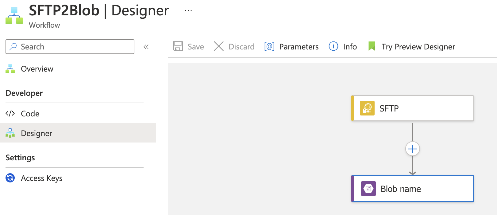
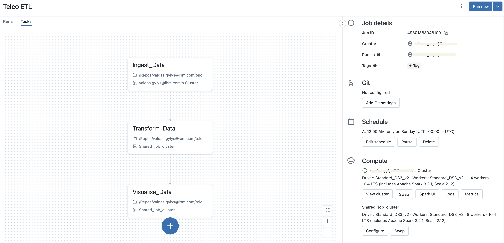
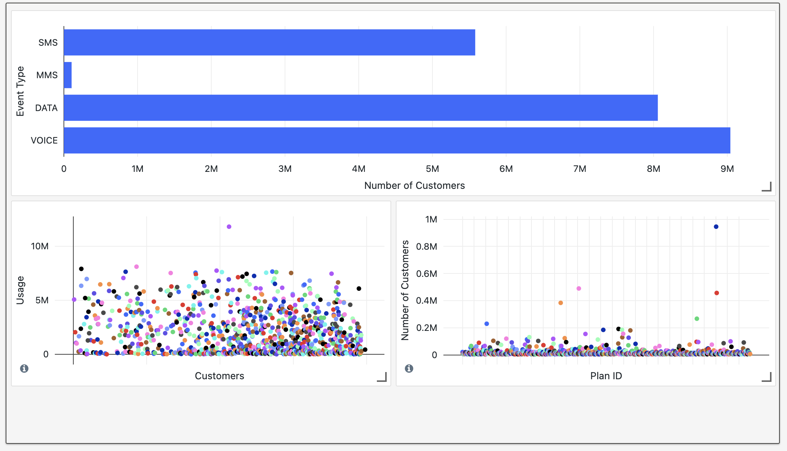

# Sample ETL pipeline for Fancy Telco Co.

### Architecture Decsription

Client stores data on SFTP server and data is updated wekly. 
Due to data scale (initial 1.66 Gb CSV) Spark Engine is chosen to manipulate data. Best commercial application of Spark
is Databrics, at the same time giving opportunity to do other required tasks:
- data ingest
- data validation and quick notifications
- data transformation
- simple vizualisation

Azure is chosen as a cloud provider allowing easiest integration and additional services for SFTP file management.

### Azure Setup
- Storage account is set up to host data
- Databrics workspace for computations
- Logic app for SFTP download

### General
#### SFTP Concept
SFTP is a safe file transfer protocol based on SSH. t supports the full security and authentication functionality of SSH.
SFTP replaces FTP providing all the functionality offered, but more securely and more reliably, with easier configuration.
Data is encrypted thus SFTP protects against password sniffing and man-in-the-middle attacks. It protects the integrity of 
the data using encryption and cryptographic hash functions, and autenticates both the server and the user.

File from SFTP to Azure Blob Storage is loaded using Azure logic app, having a trigger sensor to start upload once file structure changes:



#### Azure Blob Storage
Data is stored in tiers of raw and silver. Data from SFTP is downloaded to raw folder and after transformation is saved to silver.
Due to requirements lifecycle is set to delete files after 7 days:

```
{
  "rules": [
    {
      "enabled": true,
      "name": "Delete after 7 days",
      "type": "Lifecycle",
      "definition": {
        "actions": {
          "version": {
            "delete": {
              "daysAfterCreationGreaterThan": 7
            }
          },
          "baseBlob": {
            "delete": {
              "daysAfterCreationGreaterThan": 7
            }
          },
          "snapshot": {
            "delete": {
              "daysAfterCreationGreaterThan": 7
            }
          }
        },
        "filters": {
          "blobTypes": [
            "blockBlob"
          ]
        }
      }
    }
  ]
}
```


#### Databricks concept
Connection with Databricks and Blob storage is done via secret scope and a Databricks key vis CLI:
```
db secrets create-scope --scope myblob
db secrets put --scope myblob --key accesskey
```
Databricks consist project consists of three distinct dirrectories: constants, functions and scripts. Constants contains blob folders, account and scope names. Functions contain functions needed to run scripts. Scripts are the workhorse of the project:
- ingest_data: script validates schema and data, ingests data to dbfs file system
- transform_data: transforms data according business requirements
- visualize_data: cretaes vizualisation and dashboard

Databricks workflow connects all the scripts and run jobs on weekly basis sending email messages on failed execution. Also error log is sent everytime null or duplicate values found in raw data customer_id field:


Data Errors (nulls and duplicates in customer_id) in the file are cought with python script.

#### Visualisations
As per request, interaction_type / customer, plan / customer, usage / customer charts are plotted on dashboard.



### Things to consider
**Raw data structure** think about better way to name the files based on ingest date.

**Inremental load** think about adding incremental load actions, to append new data, modify if exists.

**Data partitioning** think about partitioning. Data as is in csv file is difficult to partition to meet bussiness goals (customer_id's are unique, there are way too many plan_ids for partition to make sense).
**Unit Tests** to test functions
